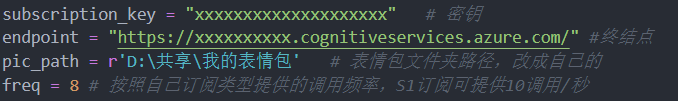
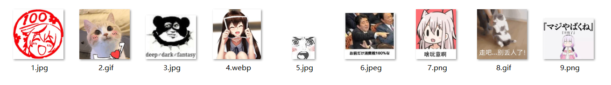
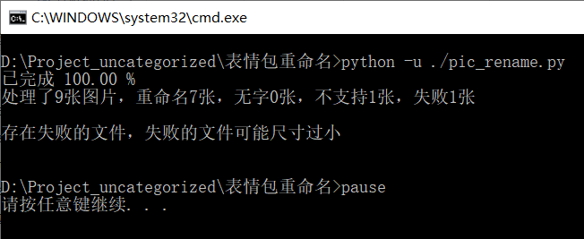
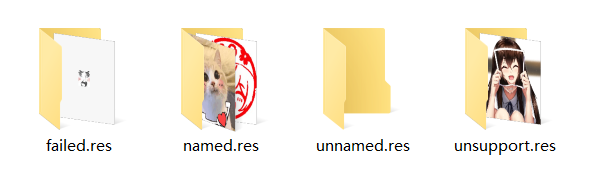
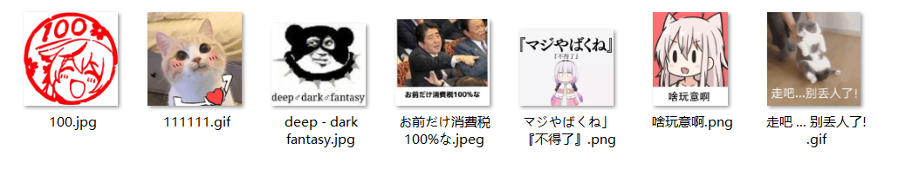

# 表情包OCR重命名

## 简介
为了方便本地表情包的管理，写了这个工具。

本程序通过Python调用微软Azure的OCR API，实现识别表情包中的文字，并用于重命名表情包，便于检索。OCR结果中过滤了"@XXX"格式的水印（例如微博水印）以及"XXX.XXX"的独立的网站链接，将"?"替换成了“问号”，并将非法字符替换成了"-"。

**P.S. 注意，OCR的识别效果有限，部分结果还需要手动修改。无法重命名的图片会搬移到对应的文件夹。**

## 前置条件
需要先[注册Azure](https://azure.microsoft.com/zh-cn/products/cognitive-services/computer-vision/)，并创建一个计算机视觉的实例，之后在新创建的计算机视觉页面的“资源管理-密钥和终结点”中可以找到自己密钥和终结点链接。如果是学生可以使用教育认证，认证后可以使用S1订阅类型，API调用速度10次/秒，而普通免费用户只能20次/分钟，并且限制每月5000次。**千万要注意不要泄漏自己的密钥**。具体的方法在这个[链接](https://learn.microsoft.com/zh-cn/azure/cognitive-services/computer-vision/quickstarts-sdk/client-library?tabs=visual-studio&pivots=programming-language-python)里有。

此外，还需要有Python 3.x，并安装azure-cognitiveservices-vision-computervision和pillow，方法也在上面链接有。

## 对于图像的要求
在[Azure的文档](https://learn.microsoft.com/zh-cn/azure/cognitive-services/computer-vision/how-to/call-read-api)里提到了API调用的限制：

+ 支持的文件格式：JPEG、PNG、BMP、PDF 和 TIFF **（本程序通过GIF第一帧转PNG增加了对GIF的支持）**
+ 对于 PDF 和 TIFF 文件，最多处理 2000 个页面（对于免费层，只处理前两个页面）。 **（未测试，这两种格式的表情包不常见）**
+ 图像的文件大小必须小于 500 MB（对于免费层，则为 4 MB），且尺寸介于 50 x 50 和 10000 x 10000 像素之间。 PDF 文件没有大小限制。
+ 对于 1024 x 768 的图像，要提取的文本的最小高度为 12 像素。 这对应于大约 8 个字体点文本，即 150 DPI。

## 代码中的参数配置
1. 密钥和终结点需要填到代码对应位置
2. 填好表情包对应文件夹路径
3. 填好API调用频率

## 使用方法

将run.bat和pic_rename.py放在同一个目录，双击run.bat运行。

程序执行完成后会创建named.res、unsupport.res、unnamed.res、failed.res 4个文件夹，分别放置完成重命名、不支持的文件格式、未识别出文字的文件、识别失败的文件。下次有新的表情包，放回到原来的位置并重新运行程序，即可将新的表情包归类。

## TODO
+ 未重命名的图片使用图片描述（Azure目前图片描述仅支持英文）
+ 优化GIF缓存逻辑，目前方法的是GIF提取的PNG文件缓存到temp.res，程序运行完成后再删除，如果出现大量GIF后会导致运行过程中大量空间占用